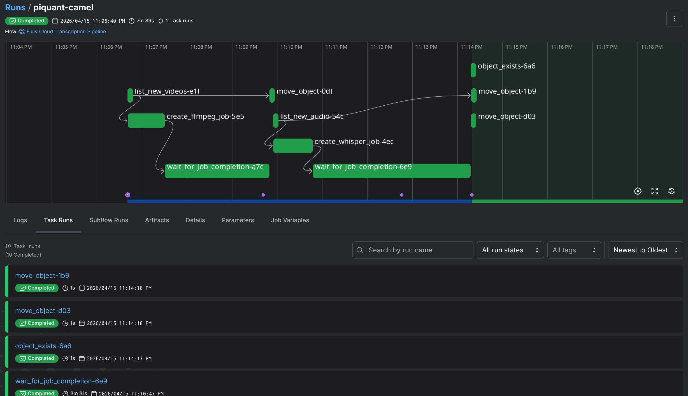
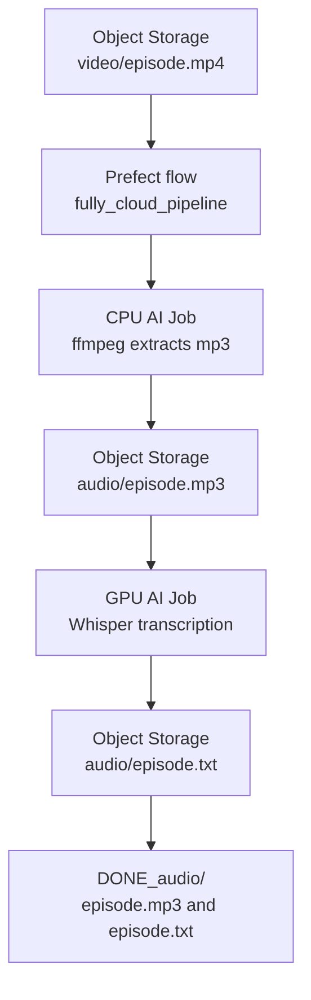

# Video Transcription Pipeline with Prefect and Nebius AI Jobs

This example shows a small MLOps pipeline that turns videos in Object Storage into text transcripts. A [Prefect](https://www.prefect.io/) flow watches a bucket, starts a CPU job to extract audio with `ffmpeg`, starts a GPU job to transcribe that audio with Whisper, then moves the finished files into completed prefixes.

The useful bit here is not the transcription model itself. The useful bit is the pattern. Object Storage becomes the handoff point between pipeline stages, Prefect keeps the orchestration readable, and Nebius AI Jobs run the actual container workloads without you managing a VM.

For the longer writeup behind this example, see [Building a Video Transcription Pipeline with Prefect and Nebius AI](https://rup12.net/posts/video-transcription-pipeline-with-prefect-and-nebius/).

Here is what the pipeline looks like in the Prefect UI after a full run.



## What this example does

The pipeline uses an inbox-style bucket layout. Raw videos go into `video/`. Extracted audio appears in `audio/`. When a stage finishes, the original files move into `DONE_video/` or `DONE_audio/` so the next run does not pick them up again.

```text
s3://<your-bucket>/
├── video/              # raw videos waiting to be processed
│   └── episode.mp4
├── audio/              # extracted audio waiting to be transcribed
│   └── episode.mp3
├── DONE_video/         # processed videos
└── DONE_audio/         # processed audio and transcripts
    ├── episode.mp3
    └── episode.txt
```

The recommended path is the fully cloud pipeline. Your local machine submits and monitors work, but the video processing and transcription both happen in Nebius AI Jobs.



## Why this is useful

A lot of ML workflows are really a chain of small handoffs. Something lands in storage, a preprocessing step turns it into a different artifact, a model step produces an output, and then some bookkeeping decides what should happen next.

This example keeps that shape visible. The flow is normal Python, the storage work uses the S3-compatible API through `boto3`, and job creation uses the Nebius Python SDK. Prefect adds retries, logging, scheduling, and a UI, but it does not hide the cloud API calls.

## Files in this folder

```text
mlops/video-transcription-pipeline/
├── README.md
├── .env.example
├── justfile
├── pyproject.toml
└── src/video_transcriber_pipeline/
    ├── __main__.py
    ├── config.py
    ├── flows.py
    └── tasks/
        ├── extract.py
        ├── jobs.py
        └── storage.py
```

## Requirements

You need the Nebius CLI installed and authenticated, Python 3.12, `uv`, and an S3-compatible client such as the AWS CLI. You also need a Nebius Object Storage bucket, Object Storage access keys, a project ID, a subnet ID, and the bucket ID for mounting the bucket into AI Jobs.

The example uses a public `ffmpeg` image for audio extraction and a Whisper image for transcription. The default Whisper image is `ghcr.io/darko-mesaros/nebius-whisper:latest`, but you can replace it with your own image as long as it accepts an audio path as its argument and writes a `.txt` file next to the input audio.

For compute, start with the defaults in `.env.example`: a CPU preset for `ffmpeg` and a single H200 GPU preset for Whisper. If your project has different quota or regional availability, change the platform and preset values before running the flow.

This cookbook uses a [`justfile`](https://just.systems/man/en/) to keep the commands short and easy to repeat. `just` is only a command runner, not a requirement for the pipeline itself. If you do not want to install it, every recipe maps to a plain command like `uv run python -m video_transcriber_pipeline check` or `uv run python -m video_transcriber_pipeline cloud-run`.

## Step 1: configure the environment

Copy the example environment file and fill in your values.

```bash
cp .env.example .env
```

The Nebius IAM token can come from the CLI while you are testing locally.

```bash
nebius iam get-access-token
```

You also need the bucket ID, not just the bucket name, because the AI Job volume mount uses the bucket ID as its source.

```bash
nebius storage bucket get-by-name \
  --name <your-bucket-name> \
  --format jsonpath='{.metadata.id}'
```

Then sync the Python environment.

```bash
uv sync
```

For the shell commands below, load the same values into your terminal session and map the pipeline-specific Object Storage credentials to the variable names expected by the AWS CLI.

```bash
set -a
source .env
set +a

export AWS_ACCESS_KEY_ID="$NEBIUS_PIPELINE_AWS_ACCESS_KEY_ID"
export AWS_SECRET_ACCESS_KEY="$NEBIUS_PIPELINE_AWS_SECRET_ACCESS_KEY"
export AWS_DEFAULT_REGION="$NEBIUS_PIPELINE_NEBIUS_REGION"
```

## Step 2: upload a video

Upload a small video into the `video/` prefix. Keeping the first run small makes it easier to validate credentials, bucket paths, and job quota before you spend time on a large file.

```bash
aws s3 cp ./episode.mp4 "s3://$NEBIUS_PIPELINE_NEBIUS_BUCKET/video/episode.mp4" \
  --endpoint-url "$NEBIUS_PIPELINE_NEBIUS_ENDPOINT"
```

If you prefer not to export the variables into your shell, use the concrete bucket name and endpoint from your `.env` file.

## Step 3: check the bucket

Before starting any jobs, ask the flow what it sees.

```bash
just check
```

Without `just`, run the module directly.

```bash
uv run python -m video_transcriber_pipeline check
```

A healthy setup returns the videos and audio files waiting in the inbox prefixes.

```text
Result: {
  'new_videos': ['video/episode.mp4'],
  'new_audio': []
}
```

## Step 4: run the fully cloud pipeline

Now run the full pipeline.

```bash
just cloud-run
```

Without `just`, the equivalent command is:

```bash
uv run python -m video_transcriber_pipeline cloud-run
```

The flow creates one CPU job for each new video, waits for it to complete, then creates one GPU job for each new audio file and waits for that to complete too. When the transcript is present, the flow moves the audio and transcript into `DONE_audio/`.

You can watch the Prefect logs in your terminal. You can also inspect jobs from the Nebius CLI.

```bash
nebius ai job list --parent-id "$NEBIUS_PIPELINE_NEBIUS_PROJECT_ID"
nebius ai logs <job-id> --follow
```

## Expected output

After a successful run, the bucket should look like this.

```text
s3://<your-bucket>/
├── DONE_video/
│   └── episode.mp4
└── DONE_audio/
    ├── episode.mp3
    └── episode.txt
```

The command summary should include the number of jobs created and the job IDs. The exact IDs will be different in every run.

```text
Result: {
  'new_videos': 1,
  'audio_extracted': 1,
  'ffmpeg_jobs_created': 1,
  'new_audio': 1,
  'whisper_jobs_created': 1,
  'transcripts_moved': 1
}
```

## Optional: run the Prefect UI

If you want the local Prefect dashboard, start it in another terminal.

```bash
just dashboard
```

Without `just`, run:

```bash
uv run prefect server start
```

Then run `just cloud-run` again. The dashboard is useful because each task shows up separately, which makes failures much easier to reason about than a single long script.

## Optional: serve it on a schedule

For a small recurring workflow, you can serve the flow with Prefect. The included command schedules the fully cloud pipeline every 15 minutes.

```bash
just serve
```

Without `just`, run:

```bash
uv run python -m video_transcriber_pipeline serve
```

That turns the bucket into a simple drop zone. Put videos in `video/`, let the served flow pick them up, and come back to transcripts in `DONE_audio/`.

## Two details worth knowing

Nebius has two API surfaces in this example. Object operations use the S3-compatible API, so the code uses `boto3` to list, copy, delete, upload, and download files. AI Jobs use the Nebius Python SDK, so the code uses `JobServiceClient` to create and inspect jobs. That split is normal. The bucket is one system, and the job scheduler is another.

The other important detail is that job creation is not job completion. When the SDK returns a job ID, the job resource exists, but the container workload may still be running. This is why the flow has an explicit `wait_for_job_completion()` task before it moves files into the completed prefixes.

## How to adapt this

The most direct adaptation is to swap the Whisper image. Any image can work if it follows the same small contract: accept an input audio path under `/data`, write a transcript next to that input file, and exit with a non-zero status when transcription fails.

You can also change the bucket prefixes if you already have your own object layout. Set `NEBIUS_PIPELINE_VIDEO_PREFIX`, `NEBIUS_PIPELINE_AUDIO_PREFIX`, `NEBIUS_PIPELINE_DONE_VIDEO_PREFIX`, and `NEBIUS_PIPELINE_DONE_AUDIO_PREFIX` in `.env`.

For larger workloads, consider changing the container contract so one GPU job can process a directory of audio files. This sample uses one audio file per Whisper job because it is easy to understand and easy to retry. Batch mode is usually better once you care about throughput.

## Troubleshooting

If `just check` returns no files, first verify the bucket name, endpoint, region, and prefix. The pipeline only looks for files under `video/` and `audio/` by default.

If job creation fails, check that the project ID, subnet ID, bucket ID, platform, and preset all match your Nebius environment. The bucket ID is especially easy to mix up with the bucket name.

If the transcript never appears, inspect the Whisper job logs. The pipeline expects the transcription container to write `audio/<name>.txt` next to `audio/<name>.mp3` in the mounted bucket.

If a job is created but files move too early in your own adaptation, make sure you are waiting for the job workload to reach `COMPLETED`, not just waiting for the create operation to return a resource ID.

## Cleanup

Delete completed jobs if you need to free up quota in your project.

```bash
nebius ai job delete <job-id>
```

Remove test objects from Object Storage when you no longer need them.

```bash
aws s3 rm "s3://<your-bucket>/video/" --recursive --endpoint-url "https://storage.<region>.nebius.cloud"
aws s3 rm "s3://<your-bucket>/audio/" --recursive --endpoint-url "https://storage.<region>.nebius.cloud"
aws s3 rm "s3://<your-bucket>/DONE_video/" --recursive --endpoint-url "https://storage.<region>.nebius.cloud"
aws s3 rm "s3://<your-bucket>/DONE_audio/" --recursive --endpoint-url "https://storage.<region>.nebius.cloud"
```
