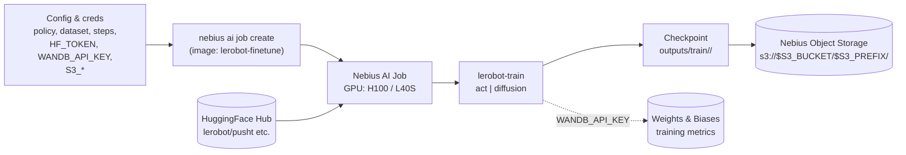

# Fine-tune a LeRobot Policy on Nebius AI Jobs

Fine-tune a [LeRobot](https://github.com/huggingface/lerobot) ACT or Diffusion policy on a robotics dataset — no physical robot or local GPU required. The job provisions a GPU, downloads the dataset from HuggingFace Hub, trains the policy, saves the checkpoint to S3, and terminates.

## Why LeRobot policies + serverless?

- What it is: LeRobot ships reference visuomotor policies (ACT, Diffusion) and training pipelines for imitation learning on robotics datasets.
- Problems they solve: learn robust manipulation behaviors from demonstrations without hand-tuned controllers. ACT is fast/lightweight for fine-grained tasks; Diffusion handles multimodal, higher-dimensional action spaces.
- Why serverless here: offload heavy GPU training to Nebius AI Jobs with reproducible images and S3 persistence—no cluster management, pay-per-use, easy to rerun with new datasets/policies.


> Default workflow: manual commands shown below. The helper scripts in `scripts/` are optional shortcuts if you prefer automation.

| Section | What you get | Typical time |
| --- | --- | --- |
| [Quick start](#-30-second-quick-start) | One `job create` on GPU (no S3 persistence) | ~2 min |
| [Step 1 — Local smoke test](#step-1--try-it-locally-first-optional-but-recommended) | Same image, CPU-only, 50 steps (default) | ~2–5 min |
| [Step 2 — Object storage](#step-2--set-up-object-storage) | Bucket + credentials + env vars | ~10–15 min first time |
| [Step 3 — GPU job with S3](#step-3--launch-a-gpu-training-job) | Train and persist checkpoint | 20–60 min (5 000 steps) |
| [Step 4 — Get checkpoint](#step-4--retrieve-the-checkpoint) | Download and inspect results | ~2 min |
| [Project layout](#project-layout) | Where code, configs, and scripts live | ~1 min read |
| [Adapting](#adapting-to-your-own-use-case) | Change dataset, policy, or step count | — |
| [Troubleshooting](#troubleshooting) | Common failures and fixes | — |

---

## ⚡ 30-second quick start

```bash
nebius ai job create \
  --name "lerobot-act-pusht" \
  --image "mnrozhkov/lerobot-finetune:v0.1.0" \
  --platform "gpu-h100-sxm" \
  --preset "1gpu-16vcpu-200gb" \
  --disk-size 450Gi \
  --timeout "6h" \
  --args "--policy act --dataset lerobot/pusht --steps 5000"
```

What this does:
- `--name`: job identifier in Nebius AI Jobs
- `--image`: training container (published example image)
- `--platform` / `--preset`: GPU + CPU/mem shape
- `--disk-size`: ephemeral disk for data + checkpoints
- `--timeout`: wall-clock limit (job is stopped after this)
- `--args`: passed to `python -m train.run` inside the container

This trains without persisting the checkpoint (the VM is removed on completion). For **saving the checkpoint to your bucket**, add the `--env` lines from [Step 3](#step-3--launch-a-gpu-training-job).

> **Multiple subnets?** If the CLI asks you to pick a subnet, export `SUBNET_ID` and append `--subnet-id "$SUBNET_ID"` to the command.

---

## What this example does



---

## Available policies and datasets

- Policies: `act` (default, fast/efficient), `diffusion` (slower per step, handles multimodal/high-D actions).
- Datasets:
  - `lerobot/pusht` — public, small, good first run.
  - `lerobot/aloha_sim_transfer_cube_human` — gated; requires `HF_TOKEN`.
- Tips:
  - `--batch-size` default 8; drop to 2 on small/local runs.
  - `NUM_WORKERS=0` (env) for low-RAM Docker runs.
  - Set `HF_TOKEN` for gated datasets; set `WANDB_API_KEY` to enable W&B.

See [Adapting to your own use case](#adapting-to-your-own-use-case) for concise manual command examples (local Docker and serverless).

**Use this example to:**
- Learn the Nebius AI Jobs submission pattern for ML training workloads
- Run a reproducible LeRobot fine-tune without managing GPU infrastructure
- Produce a portable, HF-compatible checkpoint you can evaluate or deploy

> **Not for:** production-quality policies. 5 000 steps is a validation run. For results comparable to the LeRobot paper, use 50 000–100 000 steps.

---

## Prerequisites

Install the [Nebius AI Cloud CLI](https://docs.nebius.com/cli/install) and [configure it](https://docs.nebius.com/cli/configure).

| Requirement | Why you need it |
| --- | --- |
| Nebius CLI (authenticated) | Submit and monitor jobs |
| Nebius Object Storage bucket | Persist the checkpoint (see setup below) |
| Docker (optional) | Local smoke test before using cloud credits |
| HuggingFace account (optional) | Required only for private datasets — `lerobot/pusht` is public |
| Subnet ID (sometimes) | Only if your project has **multiple subnets** |

## Step 1 — Try it locally first (optional but recommended)

Validate the container on your laptop before spending cloud credits.

Manual commands are shown below. If you prefer a shortcut, `scripts/run_docker.sh` mounts **`train/`**, **`configs/`**, and **`lerobot-outputs/`** from this folder into the container. You can edit `train/run.py` on the host and re-run **without** rebuilding (default skips build; use `--rebuild` for a fresh image).

**Build and run:**

```bash
mkdir -p lerobot-outputs
docker run --rm --platform linux/amd64 \
  --shm-size 2g \
  -v "$(pwd)/train:/lerobot/train" \
  -v "$(pwd)/configs:/lerobot/configs" \
  -v "$(pwd)/lerobot-outputs:/lerobot/outputs" \
  mnrozhkov/lerobot-finetune:v0.1.0 \
  --policy act --dataset lerobot/pusht --steps 20
```

To open a shell in the same environment (optional), reuse the same image and mounts, then run `python -m train.run …` or `lerobot-train --help` by hand.

Prefer an automated shortcut? Use `scripts/run_docker.sh` (defaults to skip rebuild; pass `--rebuild` to rebuild).

**Expected output:**

```
============================================================
LeRobot Fine-tuning Job
  Policy:   act
  Dataset:  lerobot/pusht
  Steps:    20
============================================================

Running: .../lerobot-train --policy.type=act --policy.push_to_hub=false ...

Downloading dataset: lerobot/pusht
Using device: cpu
...
S3 upload skipped — missing env vars: AWS_ACCESS_KEY_ID, AWS_SECRET_ACCESS_KEY
```

> **macOS note:** Docker on macOS cannot use NVIDIA GPUs. `Using device: cpu` is expected here — the cloud job will use CUDA. The default 50-step smoke test on CPU usually finishes in a few minutes.

---

## Step 2 — Set up object storage

Results are written to S3-compatible storage. Pick one of two setups:

**A) Use the toolkit (recommended)**

```bash
COOKBOOK_ENV_FILE=.env.lerobot bash ../../scripts/bootstrap-env.sh                   # fills PROJECT_ID/SUBNET_ID
COOKBOOK_ENV_FILE=.env.lerobot bash ../../scripts/bootstrap-storage.sh lerobot lerobot-finetune-policy  # bucket prefix + object prefix
COOKBOOK_ENV_FILE=.env.lerobot source ../../scripts/activate.sh                      # load that .env into your shell
```

- Pass a name prefix (here `lerobot`) to get a unique bucket like `lerobot-<rand>`.
- Pass an object prefix (here `lerobot-finetune-policy`) to keep artifacts under that path.
- `.env` ends up with `S3_BUCKET`, `S3_PREFIX`, `S3_ENDPOINT_URL`, `AWS_ACCESS_KEY_ID/SECRET_ACCESS_KEY`, and will reuse the same bucket on reruns.

**B) Manual setup**

Follow the [Nebius Object Storage quickstart](https://docs.nebius.com/object-storage/quickstart#configure-access-credentials-and-aws-cli-settings) to create a bucket and access keys, then export:

```bash
export AWS_ACCESS_KEY_ID="..."
export AWS_SECRET_ACCESS_KEY="..."
export AWS_DEFAULT_REGION="eu-north1"
export S3_ENDPOINT_URL="https://storage.eu-north1.nebius.cloud"
export S3_BUCKET="lerobot-<your-suffix>"
export S3_PREFIX="lerobot-finetune-policy"
```

**Verify access:**

```bash
aws s3 ls "s3://$S3_BUCKET" --endpoint-url "$S3_ENDPOINT_URL"
```

If the bucket is empty, the command prints nothing (exit 0). 

---

## Step 3 — Launch a GPU training job

```bash
nebius ai job create \
  --name "lerobot-act-pusht-5k" \
  --image "mnrozhkov/lerobot-finetune:v0.1.0" \
  --platform "gpu-h100-sxm" \
  --preset "1gpu-16vcpu-200gb" \
  --timeout "6h" \
  --disk-size 450Gi \
  --env "AWS_ACCESS_KEY_ID=$AWS_ACCESS_KEY_ID" \
  --env "AWS_SECRET_ACCESS_KEY=$AWS_SECRET_ACCESS_KEY" \
  --env "AWS_DEFAULT_REGION=$AWS_DEFAULT_REGION" \
  --env "S3_BUCKET=$S3_BUCKET" \
  --env "S3_PREFIX=$S3_PREFIX" \
  --env "S3_ENDPOINT_URL=$S3_ENDPOINT_URL" \
  ${WANDB_API_KEY:+--env "WANDB_API_KEY=$WANDB_API_KEY"} \
  --args "--policy act --dataset lerobot/pusht --steps 5000"
```

> **Multiple VPC subnets:** If your tenancy has more than one subnet, add `--subnet-id "subnet-xxxxxxxx"` to the command. With a single subnet, omit this flag.

Or use the helper script, which validates env vars and builds the command for you:

```bash
bash scripts/run_serverless.sh act lerobot/pusht 5000
```

Copy the returned job ID, then follow logs live:

```bash
nebius ai logs <job-id> --follow
```

**Healthy run looks like:**

```
============================================================
LeRobot Fine-tuning Job
  Policy:   act
  Dataset:  lerobot/pusht
  Steps:    5000
============================================================

Downloading dataset: lerobot/pusht (206 episodes, 25 650 frames)
Using device: cuda                         ← GPU confirmed
step:  100 loss: 0.0912 grad_norm: 2.841
step:  200 loss: 0.0847 grad_norm: 2.603
...
step: 5000 loss: 0.0234 grad_norm: 0.847

Uploading 12 files to s3://lerobot-checkpoints/lerobot/lerobot-act-pusht-20240501T120000/
  config.json
  model.safetensors
  ...
Checkpoint saved to s3://lerobot-checkpoints/lerobot/lerobot-act-pusht-20240501T120000/
```

---

## Step 4 — Retrieve the checkpoint

List completed runs:

```bash
aws s3 ls "s3://$S3_BUCKET/$S3_PREFIX/"
```

Download a checkpoint:

```bash
# Replace with your actual run folder name from S3
export RUN_ID="lerobot-act-pusht-<timestamp>"

aws s3 sync \
  "s3://$S3_BUCKET/$S3_PREFIX/$RUN_ID/" \
  "./lerobot-outputs/$RUN_ID/"
```

Add `--endpoint-url "$S3_ENDPOINT_URL"` only if your AWS CLI is not configured for Nebius Object Storage.

> Local runs via Docker already write checkpoints to `./lerobot-outputs/` (no S3 involved). For those, skip the sync and point eval to the folder under `lerobot-outputs/`.

**What you will find:**

```
lerobot-act-pusht-20240501T120000/
├── config.json              ← policy architecture and hyperparameters
├── model.safetensors        ← policy weights
├── preprocessor_config.json ← input normalisation config
└── train_config.json        ← full training run config for reproducibility
```

**Load and evaluate the checkpoint (local or S3-synced):**

```python
from lerobot.policies.act.modeling_act import ACTPolicy

policy = ACTPolicy.from_pretrained("./lerobot-act-pusht-20240501T120000/")
policy.eval()
```

Or use the bundled eval helper (same image; override entrypoint and mount the checkpoint + train code):

```bash
docker run --rm --platform linux/amd64 \
  --entrypoint python \
  -v "$(pwd)/train:/lerobot/train" \
  -v "$(pwd)/lerobot-outputs/$RUN_ID/checkpoints/005000/pretrained_model:/lerobot/ckpt" \
  mnrozhkov/lerobot-finetune:v0.1.0 \
  -m train.eval /lerobot/ckpt
```

The checkpoint directory must include `config.json` and `model.safetensors` (sync the whole run folder from S3 or use the local `lerobot-outputs/$RUN_ID` from a Docker run).

---

## Project layout

```
.
├── Dockerfile              CUDA runtime + uv + LeRobot + boto3
├── pyproject.toml          Runtime + dev deps (uv/ruff/typer/pydantic/rich/boto3)
├── uv.lock                 Resolved dependencies (if present)
├── train/                  Entrypoint package
│   ├── run.py              Typer CLI → lerobot-train → optional S3 upload
│   └── eval.py             Simple ACT checkpoint loader for quick verification
├── configs/
│   └── act_pusht.yaml      Reference training configuration (documented parameters)
├── lerobot-outputs/        Local checkpoints when using mounted runs
├── scripts/
│   ├── run_docker.sh           Optional local runner (default skips rebuild; add --rebuild)
│   ├── run_serverless.sh       Validate env and submit Nebius AI Job
│   └── test_policy_dataset.sh  Hardcoded local smoke set (Docker)
├── .pre-commit-config.yaml    Ruff hooks
```

---

## Adapting to your own use case

- Switch policy: `--policy diffusion` (use more steps, e.g., 20k+; consider larger disk if datasets are big).
- Switch dataset: replace `--dataset` with any compatible LeRobot dataset; for gated sets add `HF_TOKEN` (serverless: `--env HF_TOKEN=...`, Docker: `--env HF_TOKEN=...`); omit `HF_TOKEN` for public datasets like `lerobot/pusht`.
- Tune resources: adjust `--batch-size`, and for local Docker pass `NUM_WORKERS=0` env on low-RAM hosts.
- W&B logging: set `WANDB_API_KEY` env (already picked up by `train/run.py`).
- Build/push your own image: set `REGISTRY` / `IMAGE_TAG`, then `docker build --platform linux/amd64 -t "$REGISTRY/lerobot-finetune:$IMAGE_TAG" .` and push; use that tag in `--image` or `IMAGE` env.

**Serverless (ACT / pusht, with W&B)**  
Runs ACT on the public pusht dataset; uses cost-optimized L40S GPU and preemptible to save cost.

```bash
nebius ai job create \
  --name "lerobot-act-pusht-5k" \
  --image "mnrozhkov/lerobot-finetune:v0.1.0" \
  --platform "gpu-l40s-a" \
  --preset "1gpu-16vcpu-64gb" \
  --timeout "6h" \
  --disk-size 450Gi \
  --preemptible \
  --env "AWS_ACCESS_KEY_ID=$AWS_ACCESS_KEY_ID" \
  --env "AWS_SECRET_ACCESS_KEY=$AWS_SECRET_ACCESS_KEY" \
  --env "AWS_DEFAULT_REGION=$AWS_DEFAULT_REGION" \
  --env "S3_BUCKET=$S3_BUCKET" --env "S3_PREFIX=$S3_PREFIX" \
  --env "S3_ENDPOINT_URL=$S3_ENDPOINT_URL" \
  ${WANDB_API_KEY:+--env "WANDB_API_KEY=$WANDB_API_KEY"} \
  ${HF_TOKEN:+--env "HF_TOKEN=$HF_TOKEN"} \
  --args "--policy act --dataset lerobot/pusht --steps 5000"
```

**Serverless (Diffusion / gated ALOHA sim)**  
Runs Diffusion policy on a gated ALOHA simulation dataset; requires HF_TOKEN; uses L40S with modest batch size.

```bash
nebius ai job create \
  --name "lerobot-diffusion-aloha-sim-20k" \
  --image "mnrozhkov/lerobot-finetune:v0.1.0" \
  --platform "gpu-l40s-a" \
  --preset "1gpu-16vcpu-64gb" \
  --timeout "6h" --disk-size 450Gi \
  --env "AWS_ACCESS_KEY_ID=$AWS_ACCESS_KEY_ID" \
  --env "AWS_SECRET_ACCESS_KEY=$AWS_SECRET_ACCESS_KEY" \
  --env "AWS_DEFAULT_REGION=$AWS_DEFAULT_REGION" \
  --env "S3_BUCKET=$S3_BUCKET" --env "S3_PREFIX=$S3_PREFIX" \
  --env "S3_ENDPOINT_URL=$S3_ENDPOINT_URL" \
  --env "HF_TOKEN=$HF_TOKEN" \
  ${WANDB_API_KEY:+--env "WANDB_API_KEY=$WANDB_API_KEY"} \
  --args "--policy diffusion --dataset lerobot/aloha_sim_transfer_cube_human --steps 20000 --batch-size 2"
```

**Advanced: use upstream `lerobot-train` directly (config-based)**  
For power users who prefer the native CLI. The image's default `ENTRYPOINT` is `python -m train.run` (the wrapper that auto-uploads to S3), so we override it with `--container-command "bash"` and run `lerobot-train` directly, then chain `aws s3 sync` to persist the checkpoint. Ensure S3 envs (AWS_*/S3_*) and optional WANDB/HF_TOKEN are set; adjust resources to match your dataset.

This workflow lets you edit `configs/act_pusht.yaml` locally and re-run **without rebuilding the image** — the job pulls your latest config from S3 each run.

**Step A — Push the config to S3 (run again whenever you edit the YAML):**

```bash
aws s3 cp configs/act_pusht.yaml \
  "s3://$S3_BUCKET/$S3_PREFIX/configs/act_pusht.yaml" \
  --endpoint-url "$S3_ENDPOINT_URL"
```

**Step B — Submit the job:**  
The job (1) downloads the config from S3, (2) runs `lerobot-train`, (3) copies the exact config used into the run folder, (4) syncs everything back to S3 for reproducibility.

```bash
nebius ai job create \
  --name "lerobot-act-pusht-config" \
  --image "mnrozhkov/lerobot-finetune:v0.1.0" \
  --platform "gpu-l40s-a" \
  --preset "1gpu-16vcpu-64gb" \
  --timeout "6h" --disk-size 450Gi \
  --preemptible \
  --env "AWS_ACCESS_KEY_ID=$AWS_ACCESS_KEY_ID" \
  --env "AWS_SECRET_ACCESS_KEY=$AWS_SECRET_ACCESS_KEY" \
  --env "AWS_DEFAULT_REGION=$AWS_DEFAULT_REGION" \
  --env "S3_BUCKET=$S3_BUCKET" --env "S3_PREFIX=$S3_PREFIX" \
  --env "S3_ENDPOINT_URL=$S3_ENDPOINT_URL" \
  ${WANDB_API_KEY:+--env "WANDB_API_KEY=$WANDB_API_KEY"} \
  ${HF_TOKEN:+--env "HF_TOKEN=$HF_TOKEN"} \
  --container-command "bash" \
  --args "-c 'set -euo pipefail && aws s3 cp s3://\$S3_BUCKET/\$S3_PREFIX/configs/act_pusht.yaml /tmp/act_pusht.yaml --endpoint-url \$S3_ENDPOINT_URL && lerobot-train --config_path=/tmp/act_pusht.yaml --output_dir=outputs/train/act_pusht_config --policy.device=cuda && cp /tmp/act_pusht.yaml outputs/train/act_pusht_config/run_config.yaml && aws s3 sync outputs/train/act_pusht_config s3://\$S3_BUCKET/\$S3_PREFIX/act_pusht_config/ --endpoint-url \$S3_ENDPOINT_URL'"
```

> Notes:
>
> - `lerobot-train` uses [draccus](https://github.com/dlwh/draccus) — flags use **underscores** (`--config_path`, `--output_dir`, `--batch_size`) and `=`, with dots for nested fields (`--policy.device=cuda`).
> - `\$S3_BUCKET` / `\$S3_PREFIX` / `\$S3_ENDPOINT_URL` are escaped on purpose so they expand inside the container (from `--env`), not in your local shell.
> - `set -euo pipefail` makes the chain abort on the first failure instead of silently uploading a half-trained run.
> - The image still ships a copy of `configs/act_pusht.yaml` baked in at `/lerobot/configs/act_pusht.yaml` (used by the local smoke test); the S3 copy is what the cloud job actually trains against.
> - To smoke-test the same command locally before submitting: run the image with `--entrypoint bash` and the configs/train mounts, then run `lerobot-train --config_path=/lerobot/configs/act_pusht.yaml --steps=20 --batch_size=2 --policy.device=cpu` (see [Troubleshooting](#troubleshooting)).

---

## Troubleshooting

| Symptom | Fix |
| --- | --- |
| `Using device: cpu` in cloud logs | Check `--platform gpu-h100-sxm` and `--preset 1gpu-16vcpu-200gb` are set |
| `ModuleNotFoundError: lerobot` | Image not built correctly — rebuild with `docker build --no-cache` |
| Job completes but no S3 results | Check all `AWS_*` and `S3_*` env vars are set and the bucket exists |
| `multiple subnets found` on submission | Export `SUBNET_ID`, then add `--subnet-id "$SUBNET_ID"` to `job create` |
| OOM on L40S | Reduce `--batch-size` to 4 or switch to `--platform gpu-h100-sxm` |
| `No such option: --config-path` (Typer error) | You're hitting the default `python -m train.run` entrypoint. To use upstream `lerobot-train` directly, override it with `--container-command "bash"` and pass the full command via `--args "-c '...'"` (see [Advanced](#adapting-to-your-own-use-case)). |
| `lerobot-train: error: unrecognized arguments: --config-path …` | draccus uses **underscores**: pass `--config_path=...` (with `=`), not `--config-path`. Same rule for `--output_dir`, `--batch_size`, `--save_freq`. |
| `ValueError: 'policy.repo_id' argument missing. Please specify it to push the model to the hub.` | `lerobot-train` defaults to pushing the checkpoint to HF Hub. Either set `policy.push_to_hub: false` in the YAML (already done in `configs/act_pusht.yaml`) or pass `--policy.push_to_hub=false` on the CLI. The bundled `train/run.py` wrapper already does this for you. |
| Want to smoke-test the upstream CLI locally first | `docker run --rm -it --platform linux/amd64 --shm-size 2g --entrypoint bash -v "$(pwd)/configs:/lerobot/configs" -v "$(pwd)/lerobot-outputs:/lerobot/outputs" mnrozhkov/lerobot-finetune:v0.1.0`, then inside: `lerobot-train --config_path=/lerobot/configs/act_pusht.yaml --steps=20 --batch_size=2 --policy.device=cpu`. |

## References

- LeRobot project
  - Repo: https://github.com/huggingface/lerobot
  - Docs: https://huggingface.co/docs/lerobot
- Policies
  - ACT overview: https://huggingface.co/docs/lerobot/act
  - ACT paper (Zhao et al.): https://arxiv.org/abs/2304.13705
  - Diffusion Policy checkpoint (`lerobot/diffusion_pusht`): https://huggingface.co/lerobot/diffusion_pusht
  - Diffusion Policy walkthrough: https://radekosmulski.com/diving-into-diffusion-policy-with-lerobot/
  - Diffusion Policy paper (Chi et al.): https://arxiv.org/abs/2303.04137
- Datasets
  - `lerobot/pusht`: https://huggingface.co/datasets/lerobot/pusht
  - `lerobot/aloha_sim_transfer_cube_human`: https://huggingface.co/datasets/lerobot/aloha_sim_transfer_cube_human
  - LeRobot datasets index: https://huggingface.co/datasets?other=LeRobot
- Nebius
  - AI Jobs: https://docs.nebius.com/serverless
  - CLI install / configure: https://docs.nebius.com/cli/install , https://docs.nebius.com/cli/configure
  - Object Storage quickstart: https://docs.nebius.com/object-storage/quickstart

---

## Development and debug guide

```bash
cd robotics/lerobot-finetune-job
uv sync --group dev # creates .venv and installs deps (runtime + dev)
source .venv/bin/activate
pre-commit install # optional: ruff lint/format on commit
ruff check .
python -m train.run --help

# Build image locally (dev tag)
docker build --platform linux/amd64 -t lerobot-finetune:dev .
```
