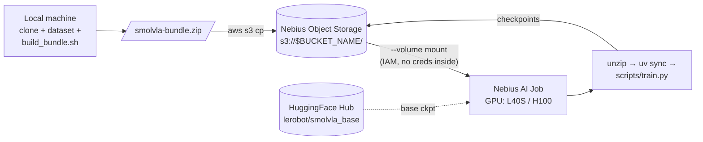

# Fine-tune SmolVLA for the SO-101 arm

End-to-end walkthrough for fine-tuning the [NormaCore SmolVLA](https://github.com/norma-core/norma-core/tree/dev/software/ai/smolvla_py) policy on the public SO-101 cube dataset using Nebius AI Jobs. Follows the upstream **bundle workflow** ([`norma-core/.../nebius.md`](https://github.com/norma-core/norma-core/blob/dev/software/ai/smolvla_py/nebius.md)): clone the repo, fetch the parquet dataset, zip everything into a self-contained bundle, upload it to Nebius Object Storage, and run a job that extracts and trains. No physical robot or local GPU required. Designed for fast experiment loops — change Python code, rebuild the bundle, resubmit; the bucket is the handoff layer, no image rebuild needed.

## About SmolVLA

SmolVLA is a compact (~450 M params) vision-language-action policy from HuggingFace / LeRobot, designed for low-latency manipulation on real hardware. It takes camera frames + proprioceptive state + a natural-language task description and emits action chunks that drive the robot directly. The base checkpoint `lerobot/smolvla_base` is what we fine-tune from.

- HF docs: <https://huggingface.co/docs/lerobot/smolvla>
- Paper (Khazatsky et al., 2024): <https://arxiv.org/abs/2406.09246>
- LeRobot repo: <https://github.com/huggingface/lerobot>


## About NormaCore

[NormaCore](https://normacore.dev) bridges the gap between complex software and real-world hardware, leading the transition from closed, fragmented robotics systems to a modular **100% open-source** architecture. By unifying a universal robotics platform with state-of-the-art AI models, it provides the standard that lets the industry scale from manual processes to intelligent solutions. The ecosystem rests on two pillars:

- **[ElRobot](https://github.com/norma-core/norma-core/tree/dev/hardware/elrobot)** — an affordable, 3D-printable 7+1 DOF reference arm purpose-built for teleoperation and reinforcement learning.
- **NormaCore Station** — a hardware-agnostic data layer that replaces fragmented vendor SDKs with a single API. It captures continuous, raw telemetry at the hardware's absolute limits, makes "capture everything" affordable via aggressive compression, and adds at-rest encryption so years of operational data stay securely accessible for production and regulated environments.

The SO-101 cube parquet used in this tutorial — and the `smolvla_py` package below — both ship from the open-source [`norma-core`](https://github.com/norma-core/norma-core) monorepo.


## What this example does



| Section | What you get | Typical time |
| --- | --- | --- |
| [Step 1 — Object storage](#step-1--set-up-object-storage-cookbook-toolkit) | Bucket + AWS-style creds in `.env.smolvla` (cookbook toolkit) | ~2 min first time |
| [Step 2 — Clone upstream](#step-2--clone-the-upstream-code) | Local `norma-core/` checkout for `build_bundle.sh` | ~1 min |
| [Step 3 — Download dataset](#step-3--download-the-dataset) | 535 MB SO-101 cube parquet → `datasets/dataset.parquet` | ~2 min |
| [Step 4 — Build & upload bundle](#step-4--build-and-upload-the-bundle) | `smolvla-bundle.zip` in S3 (`code/smolvla-bundle.zip`) | ~3–5 min |
| [Step 5 — Run training job](#step-5--run-the-training-job) | Fine-tune on L40S; checkpoints stream to S3 (`runs/$RUN_TAG/`) | 15–25 min (smoke) |
| [Step 6 — Download results](#step-6--download-results) | Pull checkpoint folder from S3 | ~1 min |
| [Iterate](#iterate-edit-code-rebuild-resubmit) | Edit code, rebuild bundle, resubmit (no image rebuild) | ongoing |
| [Adapting](#adapting--scaling-up) | Scaling profiles (Smoke / Mid / Production) | reference |
| [Troubleshooting](#troubleshooting) | Common failures and fixes | reference |

## Dataset preview

<video src="https://normacore.dev/datasets/so101-cube/dataset.mp4" controls muted width="720">
  Your browser doesn't support inline video — <a href="https://normacore.dev/datasets/so101-cube/dataset.mp4">download the preview</a>.
</video>

| Item | URL |
| --- | --- |
| Preview video | <https://normacore.dev/datasets/so101-cube/dataset.mp4> |
| Training Parquet | <https://normacore.dev/datasets/so101-cube/dataset.parquet> |

---

## Prerequisites

| Tool | Why |
| --- | --- |
| [Nebius CLI](https://docs.nebius.com/cli/install) (authenticated) | Create bucket, submit and monitor jobs |
| [AWS CLI v2](https://docs.aws.amazon.com/cli/latest/userguide/getting-started-install.html) | Upload bundle / download checkpoints (the cookbook toolkit configures credentials for you) |
| [`uv`](https://docs.astral.sh/uv/) | Build the bundle locally; run smolvla scripts |
| GPU quota | L40S or H100 for the training job |

The S3 endpoint follows the bucket region: `https://storage.<region>.nebius.cloud` (e.g. `eu-north1`). The cookbook bootstrap scripts handle bucket creation and write Nebius access keys into a per-example `.env.smolvla` file — you don't need to manage `~/.aws/credentials` profiles by hand for this tutorial.

---

## Step 1 — Set up object storage (cookbook toolkit)

Run from `robotics/smolva-ft-norma-core/` (this folder):

```bash
cd robotics/smolva-ft-norma-core

COOKBOOK_ENV_FILE=.env.smolvla bash ../../scripts/bootstrap-env.sh                                       # fills PROJECT_ID/SUBNET_ID
COOKBOOK_ENV_FILE=.env.smolvla bash ../../scripts/bootstrap-storage.sh smolvla smolvla-ft-norma-core   # bucket prefix + object prefix
COOKBOOK_ENV_FILE=.env.smolvla source ../../scripts/activate.sh                                          # load .env.smolvla into the shell
```

- The first script fills `PROJECT_ID`, `SUBNET_ID`, `NEBIUS_REGION`.
- The second creates a unique bucket like `smolvla-<rand>` (idempotent — reuses the same bucket on rerun) and writes `BUCKET_NAME`, `BUCKET_ID`, `S3_BUCKET`, `S3_PREFIX`, `S3_ENDPOINT_URL`, `AWS_ACCESS_KEY_ID`, `AWS_SECRET_ACCESS_KEY`, `AWS_DEFAULT_REGION` into `.env.smolvla`.
- The third sources those values into the current shell. After this, `aws s3` picks up credentials from env vars — no `--profile` flag needed.

Verify the env is loaded:

```bash
echo "$BUCKET_NAME / $BUCKET_ID / $S3_ENDPOINT_URL"
aws s3 ls "s3://$BUCKET_NAME" --endpoint-url "$S3_ENDPOINT_URL"
```

(Empty bucket prints nothing — exit 0.)

> **New shell later?** Just re-run `COOKBOOK_ENV_FILE=.env.smolvla source ../../scripts/activate.sh` to reload the env.

---

## Step 2 — Clone the upstream code

Stay in `robotics/smolva-ft-norma-core/` — clone the [`norma-core`](https://github.com/norma-core/norma-core) monorepo into this folder so all subsequent commands run from one place:

```bash
git clone https://github.com/norma-core/norma-core.git
```

After cloning, your working tree looks like:

```
robotics/smolva-ft-norma-core/
├── README.md                ← this guide
├── .env.smolvla             ← bucket + creds (from Step 1)
└── norma-core/              ← cloned here
    └── software/ai/smolvla_py/
        ├── pyproject.toml
        ├── uv.lock
        ├── nebius.md        ← upstream cloud-job recipe this README mirrors
        ├── smolvla/         ← Python package: model, dataset loader, stats
        └── scripts/
            ├── build_bundle.sh   ← packs the bundle for cloud runs
            ├── train.py          ← fine-tune entry point (Step 5 runs this)
            └── merge_datasets.py ← optional offline parquet merge
```

What ships under [`software/ai/smolvla_py`](https://github.com/norma-core/norma-core/tree/dev/software/ai/smolvla_py), and how each piece is used here:

- **`smolvla/`** — Python package wrapping SmolVLA with a Parquet-based dataset loader tuned for the SO-101 arm. The bundle ships this verbatim so the cloud job has the same code as a local run.
- **`scripts/build_bundle.sh`** — packs `smolvla/`, `pyproject.toml`, `uv.lock`, `scripts/`, plus the parquet files you pass on the CLI into one self-contained `smolvla-bundle.zip`. Re-run on every code or data change (Step 4).
- **`scripts/train.py`** — the fine-tune loop the cloud job runs. Accepts `--parquets`, `--steps`, `--batch-size`, `--log-every`, `--output`, etc. The Step 5 job invokes it through `uv run` after `uv sync`.
- **`nebius.md`** — the upstream cloud-job recipe this README mirrors. If you ever need to port to another CUDA host (vast.ai, RunPod, on-prem), it's the source of truth.
- *Off-tutorial:* `scripts/run_policy.py` is also in the upstream repo for on-device evaluation, but it depends on the full norma-core monorepo (`station_py` + protobufs) and isn't included in the bundle.

> **Tip:** the folder already ships a `.gitignore` with `norma-core/` and `datasets/` so the clone and downloaded parquets stay untracked. If you reuse this layout elsewhere, mirror those entries (and add `*.zip`, `checkpoint/` if you build/download here too).

---

## Step 3 — Download the dataset

Pull the public SO-101 cube sample into a local `datasets/` folder:

```bash
mkdir -p datasets
curl -L -o datasets/dataset.parquet \
  https://normacore.dev/datasets/so101-cube/dataset.parquet
```

Verify:

```bash
ls -lh datasets/dataset.parquet
```

> Multiple Parquets? Download more files into `datasets/` and pass them all to `build_bundle.sh` in Step 4 — it merges them into the bundle automatically.

---

## Step 4 — Build and upload the bundle

The bundle is a self-contained zip: `pyproject.toml`, `uv.lock`, the `smolvla/` package, the `scripts/` directory, plus the Parquet datasets you pass on the CLI. The remote job extracts it, runs `uv sync`, and trains.

`build_bundle.sh` `cd`s into `smolvla_py/` internally, so pass an **absolute** dataset path (`$(pwd)/datasets/...`) when invoking it from this folder. The output zip lands at `norma-core/software/ai/smolvla_py/smolvla-bundle.zip`.

Build (idempotent — rerun whenever code or datasets change):

```bash
bash norma-core/software/ai/smolvla_py/scripts/build_bundle.sh \
  "$(pwd)/datasets/dataset.parquet"
```

Upload (uses `AWS_*` env vars from `activate.sh` — no `--profile` needed):

```bash
aws s3 cp \
  norma-core/software/ai/smolvla_py/smolvla-bundle.zip \
  "s3://${BUCKET_NAME}/code/smolvla-bundle.zip" \
  --endpoint-url "$S3_ENDPOINT_URL"
```

---

## Step 5 — Run the training job

Demo defaults: `BATCH_SIZE=8`, `STEPS=2000`. This is sized for L40S (48 GB VRAM) and finishes in ~15–25 min — enough to see loss drop from ~0.4 to ~0.1 and exercise the full S3-checkpoint pipeline. For production-quality runs, see [Adapting](#adapting--scaling-up).

```bash
RUN_TAG="fine-tune-$(date +%F-%H%M)"

nebius ai job create \
  --name      "smolvla-finetune-${RUN_TAG}" \
  --image     "ghcr.io/astral-sh/uv:python3.12-bookworm-slim" \
  --platform  "gpu-l40s-a" \
  --preset    "1gpu-24vcpu-96gb" \
  --preemptible \
  --timeout   "2h" \
  --volume    "${BUCKET_ID}:/mnt/bucket:rw" \
  --env       "PYTHONUNBUFFERED=1" \
  --env       "RUN_TAG=${RUN_TAG}" \
  ${HF_TOKEN:+--env "HF_TOKEN=$HF_TOKEN"} \
  --working-dir       "/workspace" \
  --container-command "/bin/bash" \
  --args '-lc "python -m zipfile -e /mnt/bucket/code/smolvla-bundle.zip . && cd smolvla-bundle && uv sync && uv run python scripts/train.py --steps 2000 --batch-size 8 --log-every 5 --parquets datasets/dataset.parquet --output /mnt/bucket/runs/$RUN_TAG"'
```

What it does, in order: extract the bundle from `/mnt/bucket/code/`, `cd` into it, `uv sync` to install pinned deps, run `scripts/train.py`, write checkpoints to `/mnt/bucket/runs/$RUN_TAG/`.

Why these flags matter:

- **`--steps 2000 --batch-size 8`** are inlined as literals — to change them, edit the `--args` string directly. Env vars are reserved for values that *must* live in the container env: `PYTHONUNBUFFERED`, `HF_TOKEN`, and `RUN_TAG` (generated dynamically from the local shell, used both in `--name` and inside the container script as `$RUN_TAG`).
- **`PYTHONUNBUFFERED=1`** — `scripts/train.py` uses plain `print(...)` without `flush=True`. Without this env var, Python block-buffers stdout under the cloud-job logger and the run *looks* frozen for tens of minutes before anything appears.
- **`--log-every 5`** — `train.py` defaults to `--log-every 20`. Combined with a slow first batch, you'd wait minutes for the first heartbeat. `5` gives a useful "is this thing alive?" signal within a minute.
- **`HF_TOKEN`** — optional but recommended; the entrypoint pulls `lerobot/smolvla_base` from the HF Hub and unauthenticated requests are rate-limited.

> **Multiple subnets?** Add `--subnet-id "$SUBNET_ID"` if the CLI asks you to pick one.

Watch logs:

```bash
nebius ai job list
nebius ai job logs <job-id> --follow
```

Healthy run looks like:

```
+ python -m zipfile -e /mnt/bucket/code/smolvla-bundle.zip .
+ cd smolvla-bundle
+ uv sync
...
+ uv run python scripts/train.py --steps 2000 --batch-size 8 --log-every 5 ...

episodes: 110 frames: 29950
Loading base checkpoint lerobot/smolvla_base ...
trainable params: 99,880,992 / 450,046,176 (22.2%)
train batches/epoch: 3744                  ← reflects batch_size=8

step      5/2000 loss 0.4231 lr 5.00e-06 (0.42 step/s)
step     10/2000 loss 0.4087 lr 1.00e-05 (0.51 step/s)
...
step   2000/2000 loss 0.0934 lr 2.50e-06 (0.55 step/s)
  [save] /mnt/bucket/runs/fine-tune-2026-05-04-1430/step-002000

done — final checkpoint at /mnt/bucket/runs/fine-tune-2026-05-04-1430/final
```

---

## Step 6 — Download results

List what's available:

```bash
aws s3 ls "s3://${BUCKET_NAME}/runs/${RUN_TAG}/" \
  --endpoint-url "$S3_ENDPOINT_URL"
```

Pull a specific step folder (or `final`) with `aws s3 sync`:

```bash
aws s3 sync \
  "s3://${BUCKET_NAME}/runs/${RUN_TAG}/step-010000/" \
  ./checkpoint/ \
  --endpoint-url "$S3_ENDPOINT_URL"
```

What you get:

```
checkpoint/
├── config.json              ← policy architecture and hyperparameters
├── model.safetensors        ← policy weights
├── preprocessor_config.json ← input normalisation config
└── train_config.json        ← full training run config for reproducibility
```

---

## Iterate: edit code, rebuild, resubmit

The bundle workflow's main strength: change Python code, rebuild the zip, re-upload, and resubmit — no Docker rebuild required.

```bash
# edit norma-core/software/ai/smolvla_py/smolvla/... or .../scripts/train.py

bash norma-core/software/ai/smolvla_py/scripts/build_bundle.sh \
  "$(pwd)/datasets/dataset.parquet"

aws s3 cp \
  norma-core/software/ai/smolvla_py/smolvla-bundle.zip \
  "s3://${BUCKET_NAME}/code/smolvla-bundle.zip" \
  --endpoint-url "$S3_ENDPOINT_URL"

# resubmit Step 5 with a fresh RUN_TAG
```

---

## Adapting / scaling up

The Step 5 demo command is sized for L40S (48 GB VRAM) and a ~20-minute run. To match the production recipe from the [HuggingFace SmolVLA docs](https://huggingface.co/docs/lerobot/smolvla) (`batch_size=64, steps=20000`, ~4 h on A100 80 GB), bump GPU and hyperparameters together:

| Profile | Platform / preset | `BATCH_SIZE` | `STEPS` | Wall-clock | Use for |
| --- | --- | --- | --- | --- | --- |
| **Smoke (default)** | `gpu-l40s-a` / `1gpu-24vcpu-96gb` | 8 | 2 000 | ~15–20 min | First run; verify pipeline; demo |
| Mid | `gpu-l40s-a` / `1gpu-16vcpu-96gb` | 16 | 5 000 | ~1 h | Inspect loss curve; quick sanity tune |
| Production | `gpu-h100-sxm` / `1gpu-16vcpu-200gb` | 64 | 20 000 | ~4 h | Match HF SmolVLA paper recipe |

Other knobs:

- **`--save-every`** — defaults to 1 000. For longer runs, leave at default; for the smoke profile the script saves at step 2 000 + `final/` regardless.
- **`--num-workers`** — defaults to 2. Bump to 4 on H100 if GPU is starved waiting on the dataloader.
- **W&B logging** — `scripts/train.py` doesn't wire up W&B itself, but the upstream norma-core repo accepts `WANDB_API_KEY` env. Pass `--env "WANDB_API_KEY=$WANDB_API_KEY"` if you've enabled it locally.

---

## Evaluate on hardware (out of scope here)

After training, evaluate on the physical SO-101 arm using the upstream `run_policy.py` (requires the full `norma-core` monorepo for `station_py` + protobufs):

```bash
cd norma-core/software/ai/smolvla_py   # the clone you made in Step 2

uv run python scripts/run_policy.py \
  --checkpoint  /path/to/checkpoint \
  --task        "place the yellow cube on top of the other" \
  --bus-serial  <ST3215_bus_id> \
  --auto --max-ticks 200
```

---

## Troubleshooting

| Symptom | Fix |
| --- | --- |
| `BUCKET_NAME` / `BUCKET_ID` empty after `cd` to norma-core | Re-source the env: `COOKBOOK_ENV_FILE=.env.smolvla source <path-to>/serverless-cookbook/scripts/activate.sh` |
| `Missing env file: .env.smolvla` from `activate.sh` | Run Step 1's bootstrap commands first; they create the file |
| `aws s3`: `Unable to locate credentials` | `AWS_*` env vars not loaded — re-source `activate.sh` (Step 1) |
| Volume not mounted (`/mnt/bucket` empty) | `BUCKET_ID` must be the resource id (`storagebucket-...`), not the bucket name |
| `No such file or directory: /mnt/bucket/code/smolvla-bundle.zip` | Bundle upload failed — re-run Step 4 and verify with `aws s3 ls "s3://$BUCKET_NAME/code/"` |
| `uv sync` fails | `uv.lock` missing from bundle — make sure `build_bundle.sh` finished without errors |
| `multiple subnets found` on submission | Export `SUBNET_ID` and add `--subnet-id "$SUBNET_ID"` to `job create` |
| Logs frozen — only setup messages, no `step …` lines | Python is block-buffering stdout under the cloud-job logger. Make sure `--env "PYTHONUNBUFFERED=1"` is on the job (it is in Step 5). Also pass `--log-every 5` for an early heartbeat — `train.py` defaults to logging every 20 steps, which combined with a slow first batch can mean minutes of silence even when healthy. |
| OOM (`CUDA out of memory`) on L40S | The HF SmolVLA docs' `batch_size=64` is sized for A100 (80 GB). On L40S (48 GB) drop to **`BATCH_SIZE=8`** (default in Step 5). For mid-scale, try 16. Need batch=64? Switch to `--platform gpu-h100-sxm --preset 1gpu-16vcpu-200gb` (see [Adapting](#adapting--scaling-up)). |
| `Warning: You are sending unauthenticated requests to the HF Hub` | Pass `--env "HF_TOKEN=$HF_TOKEN"`. The base-checkpoint download will work without it but is rate-limited and can stall on retries. |

---

## References

- SmolVLA / LeRobot
  - SmolVLA overview: https://huggingface.co/docs/lerobot/smolvla
  - SmolVLA paper (Khazatsky et al.): https://arxiv.org/abs/2406.09246
  - LeRobot repo: https://github.com/huggingface/lerobot
- Norma-core
  - `smolvla_py` package: https://github.com/norma-core/norma-core/tree/dev/software/ai/smolvla_py
  - Bundle workflow source: https://github.com/norma-core/norma-core/blob/dev/software/ai/smolvla_py/nebius.md
- Datasets
  - SO-101 cube sample: https://normacore.dev/datasets/so101-cube/dataset.parquet
  - Preview video: https://normacore.dev/datasets/so101-cube/dataset.mp4
- Nebius
  - AI Jobs quickstart: https://docs.nebius.com/serverless/quickstart/jobs
  - VM types (`--platform` / `--preset`): https://docs.nebius.com/compute/virtual-machines/types
  - Object Storage quickstart: https://docs.nebius.com/object-storage/quickstart
  - CLI install / configure: https://docs.nebius.com/cli/install , https://docs.nebius.com/cli/configure